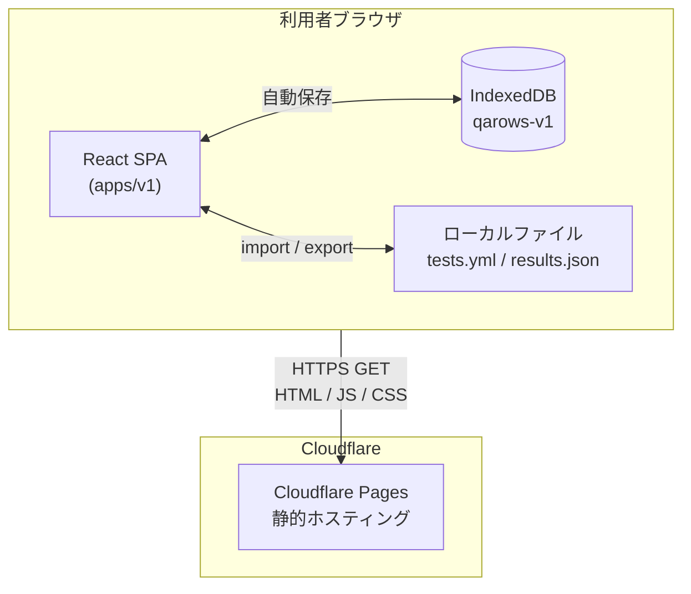
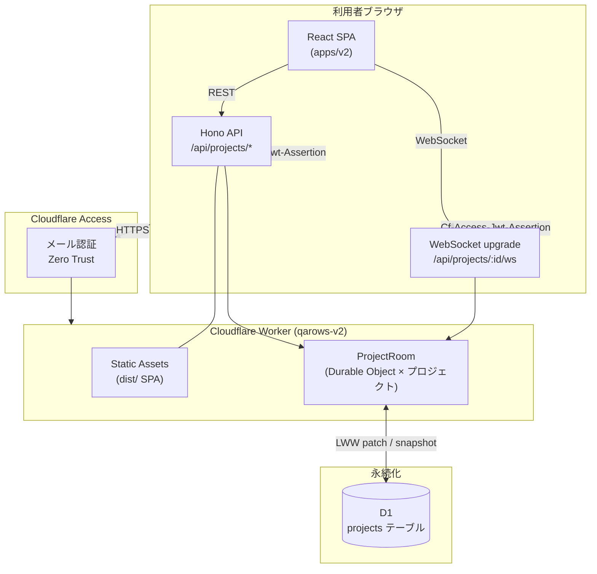
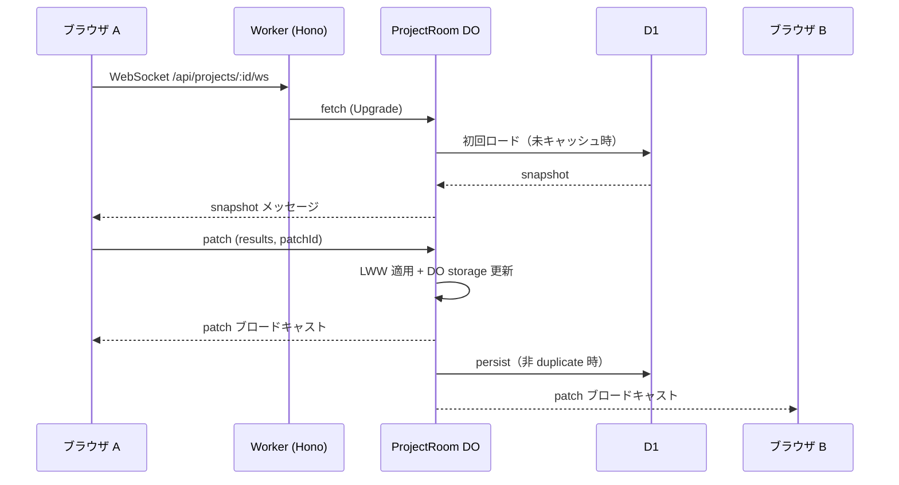
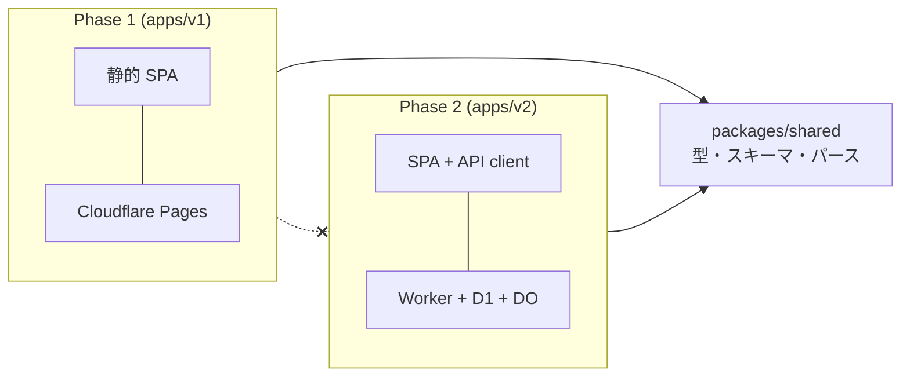

# アーキテクチャ

Phase 1 と Phase 2 は **別アプリ**（`apps/v1` / `apps/v2`）として独立デプロイ・独立利用する。本ドキュメントは各フェーズの構成要素とデータの流れを示す。

デプロイ手順は [deploy-v1.md](./deploy-v1.md) / [deploy-v2.md](./deploy-v2.md)、要件は [requirements.md](./requirements.md) を参照。

---

## Phase 1 — ブラウザ完結（公式公開）

サーバー不要の静的 SPA。テスト定義と実行結果は **利用者のブラウザ内** に保持し、ファイル import/export で共有する。

### 構成図



### コンポーネント

| レイヤ | 技術 | 役割 |
|---|---|---|
| フロントエンド | React + Vite (`apps/v1`) | テスト実行 UI、マトリクス、バグ管理 |
| ホスティング | Cloudflare Pages | ビルド成果物（`dist/`）の配信のみ |
| 永続化 | IndexedDB | プロジェクト定義・結果・セッションの自動保存 |
| 共有 | ファイル I/O | `tests.yml` 読込、`results.json` の export / import / マージ |

### データフロー（典型）

```mermaid
sequenceDiagram
  participant U as QA 担当
  participant App as qarows SPA
  participant IDB as IndexedDB
  participant File as results.json

  U->>App: tests.yml を読み込む
  App->>IDB: プロジェクト保存
  U->>App: 端末/環境を選択 → テスト実行
  loop 各テストケース
    U->>App: OK / NG / SKIP 入力
    App->>IDB: 自動保存
  end
  U->>App: results.json をエクスポート
  App->>File: ダウンロード
  Note over U,File: 別メンバーが export した JSON を<br/>import してマージ（Phase 1 協調）
  U->>App: results.json をインポート
  App->>App: ステータス競合解決（OK &lt; SKIP &lt; NG）
  App->>IDB: マージ結果を保存
```

### 特徴

- **サーバー API なし** — サービス側はデータを保持しない
- **認証なし** — 公開 URL にアクセスするだけ
- **協調は非同期** — `results.json` のファイルマージ（リアルタイム同期なし）

---

## Phase 2 — closed 環境 + リアルタイム同期

利用者各自が Cloudflare アカウントに **セルフデプロイ** する closed 環境。同一デプロイ内のメンバーが WebSocket で結果をリアルタイム同期する。

### 構成図



### コンポーネント

| レイヤ | 技術 | 役割 |
|---|---|---|
| フロントエンド | React + Vite (`apps/v2`) | プロジェクト一覧、テスト実行 UI |
| 認証 | Cloudflare Access + Worker middleware | 組織内メンバー限定アクセス |
| Worker | Hono (`worker/`) | REST API、SPA 配信、WebSocket プロキシ |
| Static Assets | Workers `[assets]` binding | ビルド済み SPA（`dist/`） |
| リアルタイム | Durable Object `ProjectRoom` | WebSocket 接続、LWW パッチ、重複排除 |
| 永続化 | D1 | プロジェクト snapshot（tests.yml / results / session） |

### データフロー（リアルタイム同期）



### REST API（概要）

| メソッド | パス | 用途 |
|---|---|---|
| GET | `/api/health` | ヘルスチェック |
| GET | `/api/me` | 認証済みユーザー |
| GET | `/api/projects` | プロジェクト一覧 |
| POST | `/api/projects` | プロジェクト作成（tests.yml） |
| GET | `/api/projects/:id` | プロジェクト詳細 |
| DELETE | `/api/projects/:id` | プロジェクト削除 |
| GET | `/api/projects/:id/ws` | WebSocket 接続（DO へ） |

### 特徴

- **1 デプロイ = 1 closed 環境** — 組織間でデータ非共有（マルチテナント SaaS ではない）
- **Access 必須（本番）** — Worker 側でも JWT を検証
- **LWW（Last Write Wins）** — 同一デプロイ内の同時編集は最新パッチが勝つ
- **D1 + DO** — DO がリアルタイム状態、D1 が永続 snapshot

---

## Phase 1 / Phase 2 の関係



| | Phase 1 | Phase 2 |
|---|---|---|
| デプロイ | メンテナが公式 1 インスタンス | 利用者が各自デプロイ |
| データ所在 | 各ブラウザの IndexedDB | 各デプロイの D1 |
| 協調 | `results.json` マージ | WebSocket リアルタイム |
| 共通 | `tests.yml` / `results.json` 形式（`packages/shared`） |

両フェーズは **独立して利用可能**。Phase 2 リリース後も Phase 1 の公式 URL は継続公開する方針（[deployment.md](./deployment.md)）。

---

## 変更履歴

| 日付 | 内容 |
|---|---|
| 2026-06-28 | 初版 |
