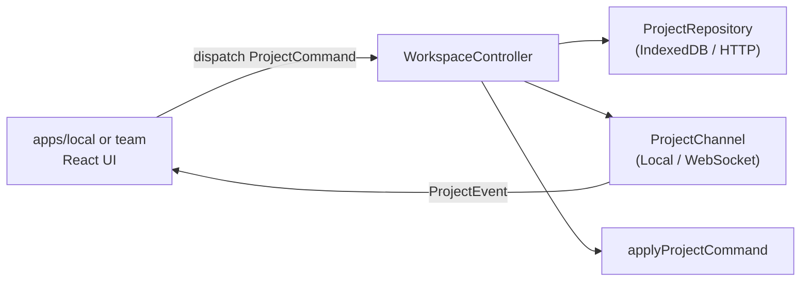
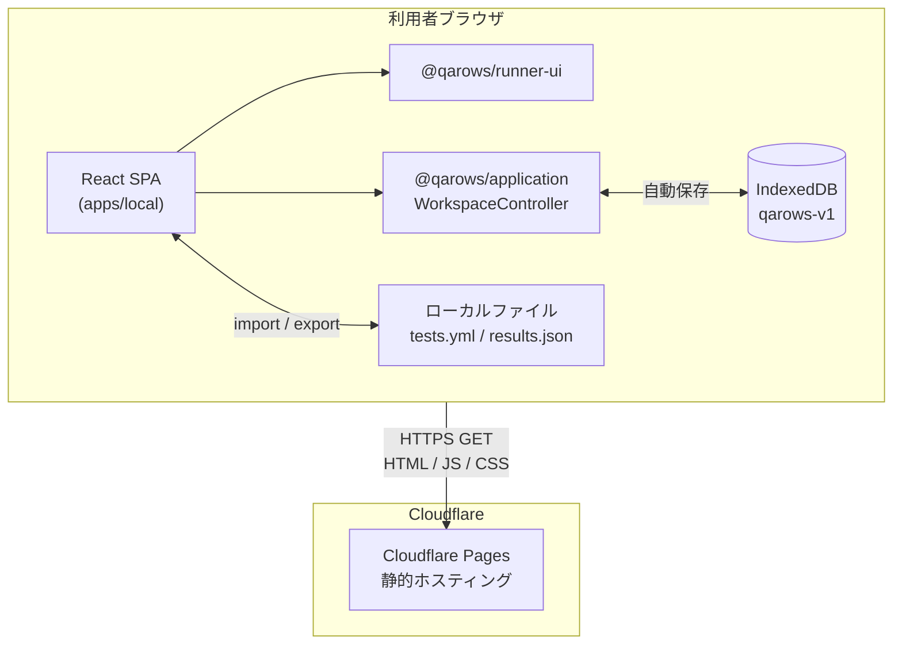
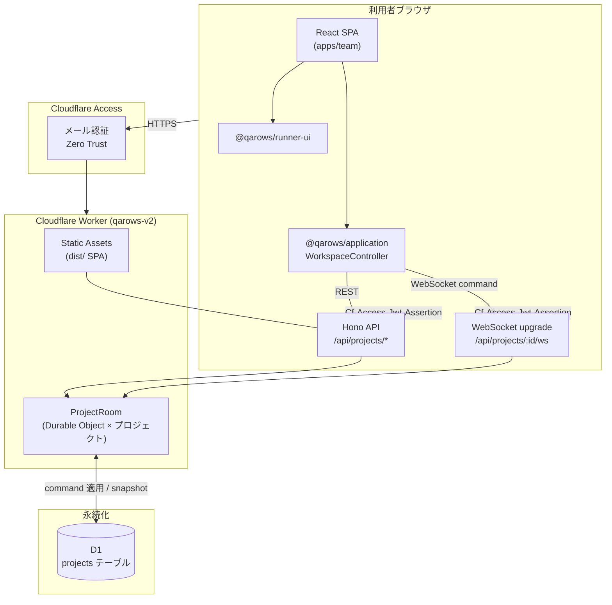
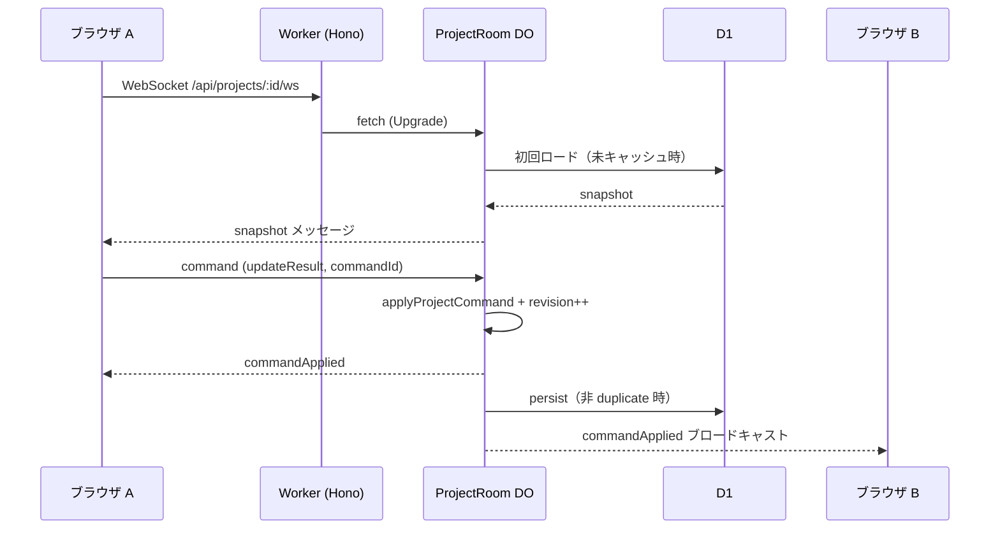
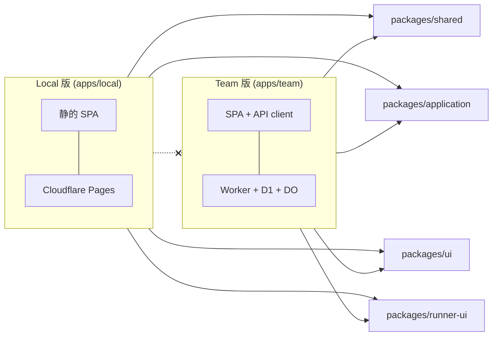

# アーキテクチャ

Local 版と Team 版は **別アプリ**（`apps/local` / `apps/team`）として独立デプロイ・独立利用する。本ドキュメントは各エディションの構成要素とデータの流れを示す。

デプロイ手順は [deploy-local.md](./deploy-local.md) / [deploy-team.md](./deploy-team.md)、要件は [requirements.md](./requirements.md) を参照。

---

## 共有パッケージ

両エディションで重複を避けるため、モノレポ内に共通レイヤを置く。

| パッケージ | 役割 |
|---|---|
| `packages/shared` | 型・スキーマ・パース・マージルール（`tests.yml` / `results.json`） |
| `packages/application` | `ProjectCommand` / `ProjectSnapshot`、`applyProjectCommand`、`WorkspaceController`、Repository / Channel のインターフェース（port） |
| `packages/ui` | プロジェクト一覧・セッション設定・同期ステータス等のワークスペース UI |
| `packages/runner-ui` | テスト実行 UI（FilterBar、TestRunner、進捗バー等）。Local / Team 版で同一レイアウト |

### アプリケーション層（`packages/application`）

UI と永続化・同期の差分を吸収する中間層。

```mermaid
flowchart LR
  UI["apps/local or team<br/>React UI"]
  Ctrl["WorkspaceController"]
  Repo["ProjectRepository<br/>(IndexedDB / HTTP)"]
  Chan["ProjectChannel<br/>(Local / WebSocket)"]
  Apply["applyProjectCommand"]

  UI -->|dispatch ProjectCommand| Ctrl
  Ctrl --> Repo
  Ctrl --> Chan
  Ctrl --> Apply
  Chan -->|ProjectEvent| UI
```

- **Local 版**: `IndexedDbProjectRepository` + `LocalProjectChannel`（即時適用）
- **Team 版**: `HttpProjectRepository` + `WebSocketProjectChannel`（DO へ command 送信）

Repository は読み出し・削除の `ProjectRepository` と、snapshot を丸ごと書き戻せる
`WritableProjectRepository` に分かれる。Team 版は定義を HTTP、結果を WebSocket command で
更新するため **書き戻しを実装しない**（`saveSnapshot` を持たない）。

`ProjectCommand` の例: `updateResult`, `updateResultsBatch`, `setSession`, `updateTestCase`, `addBug`, `mergeResults`（Local 版 のみ） 等。

---

## Local 版 — ブラウザ完結（公式公開）

サーバー不要の静的 SPA。テスト定義と実行結果は **利用者のブラウザ内** に保持し、ファイル import/export で共有する。

### 構成図

```mermaid
flowchart TB
  subgraph User["利用者ブラウザ"]
    SPA["React SPA<br/>(apps/local)"]
    RunnerUI["@qarows/runner-ui"]
    AppLayer["@qarows/application<br/>WorkspaceController"]
    IDB[("IndexedDB<br/>qarows-v1")]
    Files["ローカルファイル<br/>tests.yml / results.json"]
    SPA --> RunnerUI
    SPA --> AppLayer
    AppLayer <-->|自動保存| IDB
    SPA <-->|import / export| Files
  end

  subgraph CF["Cloudflare"]
    Pages["Cloudflare Pages<br/>静的ホスティング"]
  end

  User -->|HTTPS GET<br/>HTML / JS / CSS| Pages
```

### コンポーネント

| レイヤ | 技術 | 役割 |
|---|---|---|
| フロントエンド | React + Vite (`apps/local`) | テスト実行 UI、マトリクス、バグ管理 |
| 実行 UI | `@qarows/runner-ui` | 1 テストずつ集中入力のランナー UI |
| ホスティング | Cloudflare Pages | ビルド成果物（`dist/`）の配信のみ |
| 永続化 | IndexedDB | プロジェクト定義・結果・セッションの自動保存 |
| 共有 | ファイル I/O | `tests.yml` 読込、`results.json` の export / import / マージ |

### データフロー（典型）

```mermaid
sequenceDiagram
  participant U as QA 担当
  participant App as qarows SPA
  participant Ctrl as WorkspaceController
  participant IDB as IndexedDB
  participant File as results.json

  U->>App: tests.yml を読み込む
  App->>Ctrl: replaceSnapshot
  Ctrl->>IDB: プロジェクト保存
  U->>App: 端末/環境を選択 → テスト実行
  loop 各テストケース
    U->>App: OK / NG / SKIP 入力
    App->>Ctrl: updateResult / updateResultsBatch
    Ctrl->>IDB: 自動保存
  end
  U->>App: results.json をエクスポート
  App->>File: ダウンロード
  Note over U,File: 別メンバーが export した JSON を<br/>import してマージ（Local 版協調）
  U->>App: results.json をインポート
  App->>Ctrl: mergeResults
  Ctrl->>Ctrl: ステータス競合解決（OK &lt; SKIP &lt; NG）
  Ctrl->>IDB: マージ結果を保存
```

### 特徴

- **サーバー API なし** — サービス側はデータを保持しない
- **認証なし** — 公開 URL にアクセスするだけ
- **協調は非同期** — `results.json` のファイルマージ（リアルタイム同期なし）

---

## Team 版 — closed 環境 + リアルタイム同期

利用者各自が Cloudflare アカウントに **セルフデプロイ** する closed 環境。同一デプロイ内のメンバーが WebSocket で **ProjectCommand** をリアルタイム同期する。テスト実行 UI は Local 版 と **同一**（`@qarows/runner-ui`）。

### 構成図

```mermaid
flowchart TB
  subgraph User["利用者ブラウザ"]
    SPA2["React SPA<br/>(apps/team)"]
    RunnerUI2["@qarows/runner-ui"]
    AppLayer2["@qarows/application<br/>WorkspaceController"]
    SPA2 --> RunnerUI2
    SPA2 --> AppLayer2
    AppLayer2 -->|REST| API
    AppLayer2 -->|WebSocket command| WS
  end

  subgraph Access["Cloudflare Access"]
    Auth["メール認証<br/>Zero Trust"]
  end

  subgraph Worker["Cloudflare Worker (qarows-v2)"]
    direction TB
    ASSETS["Static Assets<br/>(dist/ SPA)"]
    API["Hono API<br/>/api/projects/*"]
    WS["WebSocket upgrade<br/>/api/projects/:id/ws"]
    ASSETS --- API
    API --> DO
    WS --> DO
  end

  subgraph Persist["永続化"]
    DO["ProjectRoom<br/>(Durable Object × プロジェクト)"]
    D1[("D1<br/>projects テーブル")]
    DO <-->|command 適用 / snapshot| D1
  end

  User -->|HTTPS| Auth
  Auth --> Worker
  User -.->|Cf-Access-Jwt-Assertion| API
  User -.->|Cf-Access-Jwt-Assertion| WS
```

### コンポーネント

| レイヤ | 技術 | 役割 |
|---|---|---|
| フロントエンド | React + Vite (`apps/team`) | プロジェクト一覧、テスト実行 UI |
| 実行 UI | `@qarows/runner-ui` | Local 版 と同一のランナー体験 |
| 認証 | Cloudflare Access + Worker middleware | 組織内メンバー限定アクセス |
| Worker | Hono (`worker/`) | REST API、SPA 配信、WebSocket プロキシ |
| Static Assets | Workers `[assets]` binding | ビルド済み SPA（`dist/`） |
| リアルタイム | Durable Object `ProjectRoom` | WebSocket 接続、command 適用、重複排除 |
| 永続化 | D1 | プロジェクト snapshot（tests.yml / results / session） |

### 同期プロトコル（Command モデル）

Team 版 のリアルタイム同期は **JSON Patch ではなく `ProjectCommand`** を送受信する。

| 方向 | メッセージ | 内容 |
|---|---|---|
| Client → DO | `{ type: "command", command, commandId, generation }` | 意図した操作を送信（`user` は接続時認証からサーバーが付与） |
| Client → DO | `{ type: "resync" }` | `revision` の取りこぼし・差分適用失敗時に全量を再要求 |
| DO → Client | `{ type: "snapshot", snapshot }` | 接続時 / resync 応答の全量 |
| DO → Client | `{ type: "commandApplied", command, revision, user, appliedAt, ... }` | 適用された command のみ（**差分配信**。全量は含まない） |

DO 側の処理:

1. `commandId` で **重複排除**（再送・再接続時）
2. `applyProjectCommand` で snapshot を更新（`now` は `appliedAt` に固定）
3. `revision` をインクリメント
4. 全接続クライアントへ `commandApplied` をブロードキャスト
5. D1 へ persist

クライアント側の処理:

- 受信した `command` を `applyProjectCommand` で自分の snapshot に再適用する。`actor` / `now` にサーバーの `user` / `appliedAt` を使うため、全クライアントが同一状態に収束する（自コマンドの echo も同様に再適用）。
- `revision` が連番から飛んだ場合・差分適用に失敗した場合は `resync` で全量スナップショットを再取得する。`revision` が既知以下の再配信は ACK としてのみ扱う。

Local 版 のファイルマージルール（OK &lt; SKIP &lt; NG）は **Local 版 専用**（`mergeResults` command）。Team 版 の同時編集は server revision 付き command 適用で整合する。

### テスト定義の編集経路（Team 版）

定義変更には **意図的に 2 経路** がある。混同しないこと。

| 経路 | 典型 UI | 同期 | `generation` | `definition_revisions` |
|---|---|---|---|---|
| **本編集** | テスト定義画面（draft → Diff → Apply）、YAML 取込 | HTTP（`definition/apply` / `PUT /definition` / `definition-revisions/:id/restore`） | **bump**（楽観ロック） | **checkpoint**（復元用） |
| **実行中の軽微修正** | ランナーのテストケース編集ダイアログ | WebSocket `updateTestCase` | **変更しない** | **作らない** |

- WS `updateTestCase` は説明・前提・分類などのその場修正向け。`revision` は増えリアルタイム同期されるが、YAML 本編集用の generation / 復元履歴とは別レイヤ。
- 本編集（HTTP apply）は `expectedGeneration` で競合検知する。ただし復元（`definition-revisions/:id/restore`）は
  「この版に戻す」という明示操作なので、その時点の generation を取り直して LWW で上書きする。ランナー側で直した直後に、古い generation のまま HTTP apply すると **ランナー側の変更は上書きされ得る**（LWW。意図どおり）。
- 破壊的な一括置換（`replaceDefinition` / `mergeResults` / `clearResults`）は WS クライアントからは受理しない（HTTP / Worker RPC のみ）。
- AI の提案は **エディタの draft に読み込むだけ**。適用は通常の本編集（`definition/apply`）を通るので、
  提案から適用までの競合検知も定義編集画面の generation で行う。専用の適用 API は持たない。

### データフロー（リアルタイム同期）

```mermaid
sequenceDiagram
  participant A as ブラウザ A
  participant W as Worker (Hono)
  participant DO as ProjectRoom DO
  participant D1 as D1

  A->>W: WebSocket /api/projects/:id/ws
  W->>DO: fetch (Upgrade)
  DO->>D1: 初回ロード（未キャッシュ時）
  D1-->>DO: snapshot
  DO-->>A: snapshot メッセージ

  A->>DO: command (updateResult, commandId)
  DO->>DO: applyProjectCommand + revision++
  DO-->>A: commandApplied
  DO->>D1: persist（非 duplicate 時）

  participant B as ブラウザ B
  DO-->>B: commandApplied ブロードキャスト
```

### REST API（概要）

| メソッド | パス | 用途 |
|---|---|---|
| GET | `/api/health` | ヘルスチェック |
| GET | `/api/me` | 認証済みユーザー |
| GET | `/api/projects` | プロジェクト一覧 |
| POST | `/api/projects` | プロジェクト作成（tests.yml） |
| GET | `/api/projects/:id` | プロジェクト詳細 |
| DELETE | `/api/projects/:id` | プロジェクト削除 |
| GET | `/api/projects/:id/ws` | WebSocket 接続（DO へ） |

### 特徴

- **1 デプロイ = 1 closed 環境** — 組織間でデータ非共有（マルチテナント SaaS ではない）
- **Access 必須（本番）** — Worker 側でも JWT を検証
- **Command + server revision** — 同一デプロイ内の編集は DO が順序付きで適用
- **定義の本編集は HTTP** — generation bump + revision checkpoint。WS `updateTestCase` は実行中の軽微修正のみ（上記「テスト定義の編集経路」）
- **D1 + DO** — DO がリアルタイム状態、D1 が永続 snapshot

---

## Local / Team 版 の関係

```mermaid
flowchart LR
  subgraph P1["Local 版 (apps/local)"]
    P1App["静的 SPA"]
    P1Pages["Cloudflare Pages"]
    P1App --- P1Pages
  end

  subgraph P2["Team 版 (apps/team)"]
    P2App["SPA + API client"]
    P2Worker["Worker + D1 + DO"]
    P2App --- P2Worker
  end

  Shared["packages/shared"]
  AppPkg["packages/application"]
  UiPkg["packages/ui"]
  RunnerPkg["packages/runner-ui"]

  P1 --> Shared
  P2 --> Shared
  P1 --> AppPkg
  P2 --> AppPkg
  P1 --> UiPkg
  P2 --> UiPkg
  P1 --> RunnerPkg
  P2 --> RunnerPkg

  P1 -.-x P2
```

| | Local 版 | Team 版 |
|---|---|---|
| デプロイ | メンテナが公式 1 インスタンス | 利用者が各自デプロイ |
| データ所在 | 各ブラウザの IndexedDB | 各デプロイの D1 |
| 協調 | `results.json` マージ | WebSocket command 同期 |
| 実行 UI | `@qarows/runner-ui` | 同一（`@qarows/runner-ui`） |
| 共通 | `tests.yml` / `results.json` 形式、`ProjectCommand` モデル |

両エディションは **独立して利用可能**。Team 版リリース後も Local 版の公式 URL は継続公開する方針（[deployment.md](./deployment.md)）。

---

## 変更履歴

| 日付 | 内容 |
|---|---|
| 2026-06-28 | 初版 |
| 2026-06-28 | Command モデル・共有パッケージ（application / ui / runner-ui）を追記 |
| 2026-08-22 | Repository port を読み出し / 書き戻しに分割。R2 添付アクセスを `worker/attachments.ts` に集約 |
